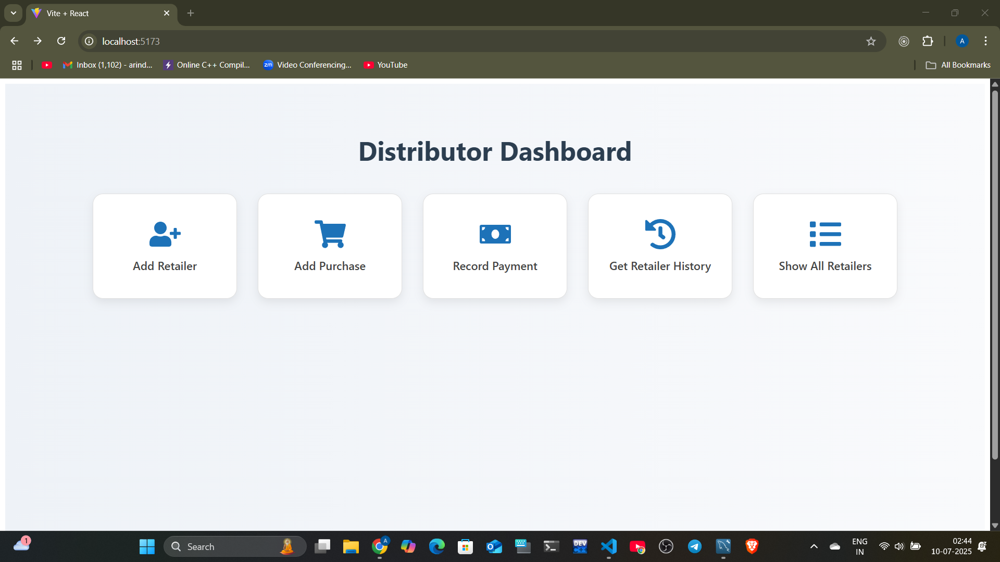
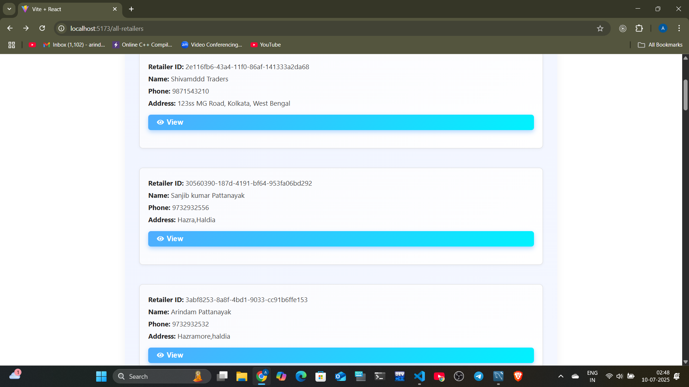

# 📦 Distributor–Retailer Management System

A SQL-based DBMS project to efficiently manage and analyze operations between product distributors and retailers. The system handles inventory management, purchases, payments, and deliveries, with relational integrity and business logic enforced via schema design.

---
## 🏗️ Tech Stack

| Layer             | Technology               |
|------------------|--------------------------|
| Database          | MySQL                    |
| Backend           | Node.js, Express.js      |
| Data Design       | SQL (DDL + DML)          |
| Schema Integrity  | Foreign Keys, ON DELETE rules, Constraints |
| UI     | React.js                 |
---

### 📸 Sample Screenshots

## 1.Distributor Dashboard

## 2.🧾 Add Retailer 

## 3.🛒 Record Purchase 

### 4.💵 Record Payment

### 5.📜 Retailer Transaction History 

### 6.📋 Show All Retailers 

